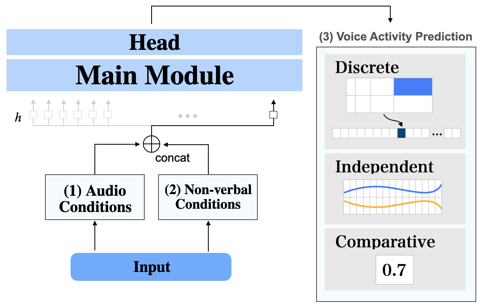
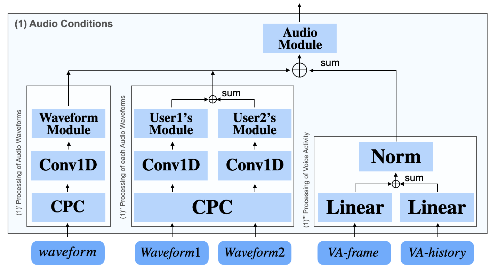
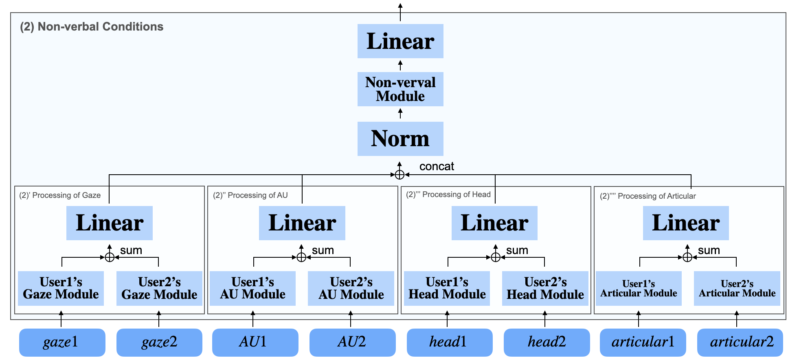

# Multimodal Voice Activity Prediction Model for Turn-taking

Model training for 
* [Multimodal Voice Activity Prediction: turntaking Events Detection in Expert-Novice Conversation]()

## Installation

* Create conda env: `conda create -n turntaking python=3.11`
  - source env: `conda source turntaking`
* PyTorch: `conda install pytorch torchvision torchaudio pytorch-cuda=11.7 -c pytorch -c nvidia`
* Dependencies: 
  * Install Cython: `pip install cython`
  * Install requirements: `pip install -r requirements.txt`
  * **VAP**: Voice Activity Projection multi-purpose "head".
    * Install [`vap_turn_taking`](https://github.com/ErikEkstedt/vap_turn_taking.git)
      * Repo. clone: `git clone https://github.com/ahclab/vap_turn_taking.git`
      * cd to repo, Install: `pip install -e .`
* Install **`turntaking`:** 
  * cd to root directory and run: `pip install -e .`

## Set Up Datasets
* **WARNING:** Requires [NoXi Database](https://multimediate-challenge.org/datasets/Dataset_NoXi/) data.
* Place the file in any directory as follows
  .
  ├──noxi
  │  ├── Augsburg_01
  │  │   ├── audio_expert.wav
  │  │   ├── audio_mix.wav
  │  │   ├── audio_novice.wav
  │  │   ├── non_varbal_expert.csv
  │  │   ├── non_varbal_novice.csv
  │  │   ├── vad_expert.txt
  │  │   └── vad_novice.txt
  │  ├── Augsburg_02
  │  │   ├── audio_expert.wav
  │  │   ├── audio_mix.wav
  │  │   ├── audio_novice.wav
  │  │   ├── non_varbal_expert.csv
  │  │   ├── non_varbal_novice.csv
  │  │   ├── vad_expert.txt
  │  │   └── vad_novice.txt
    ...

* Rewrite `EXTRACTED_PATH` in `turntaking/dataload/dataset/noxi/noxi.py` and Rewrite `AUDIO_DIR` and `MULTIMODAL_DIR` in `/turntaking/dataload/dataset/noxi/__init__.py`.

## Train and Test
1. Rewriting Model Training Conditions
The training conditions can be changed by rewriting `turntaking/conf/config.yaml`.
The model can be changed by rewriting `turntaking/conf/model/model.yaml`.

Refer to the following image for the corresponding module name of the model.




2. Model Training
```bash
python turntaking/train.py
```

3. Test
```bash
python turntaking/test.py
```

## Citation

```latex
TBA
```
